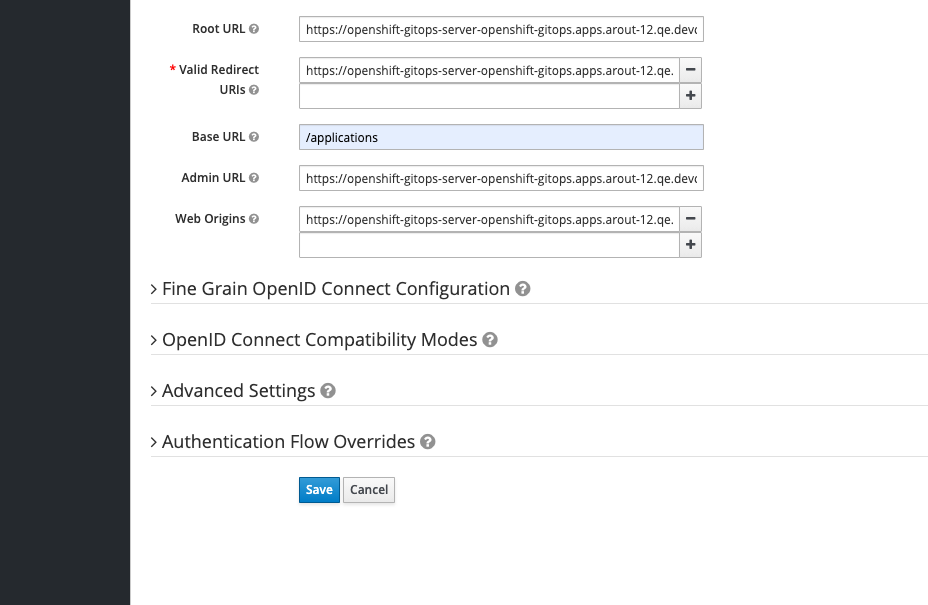
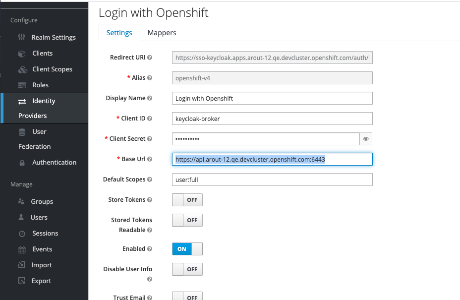
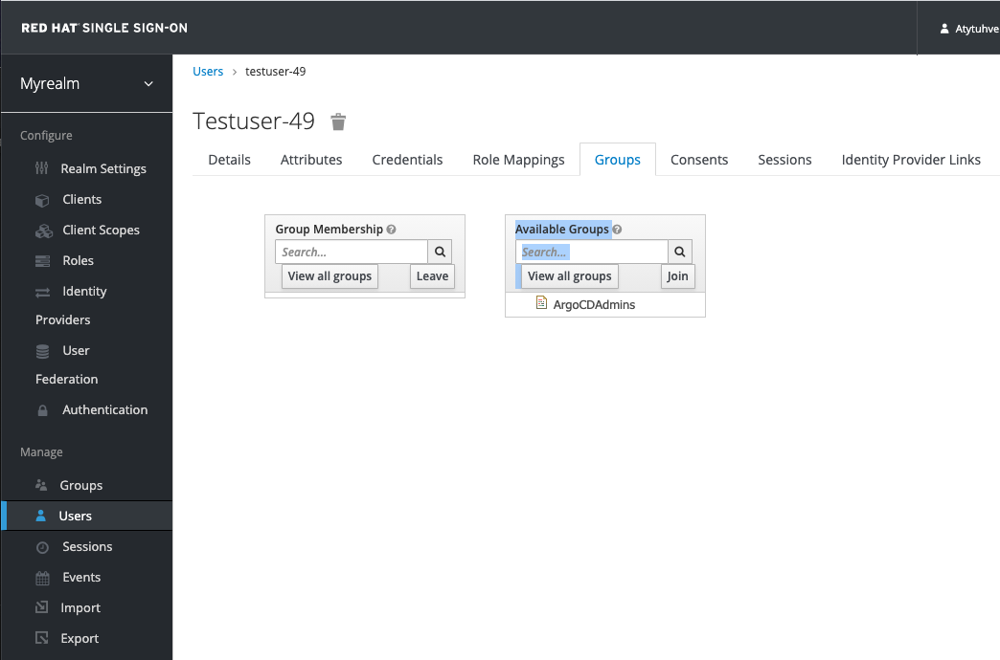

# Red Hat Single Sign On Installation
This Document descibes the steps to install RH-SSO on OCP, OSD or Disconnected Cluster using OpenShift templates and enable SSO for OpenShift Gitops.

# Inspiration
https://access.redhat.com/documentation/en-us/red_hat_single_sign-on/7.4/html/red_hat_single_sign-on_for_openshift_on_openjdk/get_started

## Login as admin
Some of the below commamds need admin privilege. Either Login as admin or login as a user with admin privilege.
```
oc login -u kubeadmin -p password 
```

## Update the core set of Red Hat Single Sign-On 7.4.6.GA resources
```
for resource in sso74-image-stream.json \
  sso74-https.json \
  sso74-postgresql.json \
  sso74-postgresql-persistent.json \
  sso74-ocp4-x509-https.json \
  sso74-ocp4-x509-postgresql-persistent.json
do
  oc -n openshift replace -f \
  https://raw.githubusercontent.com/jboss-container-images/redhat-sso-7-openshift-image/sso74-dev/templates/${resource}
done
```

## Install the Red Hat Single Sign-On Image streams:
> Run below command if you are using either OpenShift Container Platform or OpenShift Dedicated. This will fail on a Disconnected/air-gapped/proxy cluster.
```
oc -n openshift import-image rh-sso-7/sso74-openshift-rhel8:7.4 --from=registry.redhat.io/rh-sso-7/sso74-openshift-rhel8:7.4 --confirm
```

> Run below command only if you are using a Disconnected/air-gapped/proxy cluster. NOT REQUIRED FOR OCP or OSD.
```
docker pull registry.redhat.io/rh-sso-7/sso74-openshift-rhel8:7.4
docker tag registry.redhat.io/rh-sso-7/sso74-openshift-rhel8:7.4 upshift.mirror-registry.qe.devcluster.openshift.com:5000/rhsso
docker push  upshift.mirror-registry.qe.devcluster.openshift.com:5000/rhsso
oc -n openshift import-image rh-sso-7/sso74-openshift-rhel8:7.4 --from=upshift.mirror-registry.qe.devcluster.openshift.com:5000/rhsso --confirm
```

## Create a new project
```
oc new-project keycloak
```

Add the view role to the default service account.
```
oc policy add-role-to-user view system:serviceaccount:$(oc project -q):default
```

## Deploying the Template using OpenShift CLI
> List the available Red Hat Single Sign-On application templates:
```
oc get templates -n openshift -o name | grep -o 'sso74.\+'
```

> Output of this command provides all the important details like credentials.
```
oc new-app --template=sso74-ocp4-x509-https
```

# Set up Red Hat Single Sign On
> Login to RH-SSO, Get User-ID and Password from above command output.
```
oc get routes
```

**Click on Create New Realm** 
> *Select Import and Import the realm-export.json from this repo.*

The imported realm needs to be updated with argo-cd base url/argo-cd route url in the client configuration. Also, update the openshift base url in the Identity Provider section. By default, these feilds are set to some dummy place holders in the realm-export.json file.





## Configure OpenShift GitOps for **Red Hat Single Sign On** using OpenShift v4 IdP. 
Go to **Clients** -> Click on **argocd** -> Move to **Credentials** tab, Copy the Secret into the argocd-secret.
> echo -n '<secret>' | base64
> echo -n '83083958-8ec6-47b0-a411-a8c55381fbd2' | base64

**Edit the argocd-secret**
> oc edit secret argocd-secret -n openshift-gitops

and update the below line
> oidc.keycloak.clientSecret: ODMwODM5NTgtOGVjNi00N2IwLWE0MTEtYThjNTUzODFmYmQy ...

After updating, secret should look something like this
```
apiVersion: v1 
kind: Secret 
metadata: name: argocd-secret 
data:
  oidc.keycloak.clientSecret: ODMwODM5NTgtOGVjNi00N2IwLWE0MTEtYThjNTUzODFmYmQy ...
```

**Add OIDC configuration to the argocd Instance**
```
oidcConfig: |
  name: Keycloak
  issuer: https://keycloak.example.com/auth/realms/myrealm
  clientID: argocd
  clientSecret: $oidc.keycloak.clientSecret
  requestedScopes: ["openid", "profile", "email", "groups"]

```

**Note: ** Update issuer in the above section with your keycloak hostname. Keycloak hostname can be obtained from route in keycloak namespace.

# Registering an OAuth Client 
```
kind: OAuthClient
apiVersion: oauth.openshift.io/v1
metadata:
 name: keycloak-broker 
secret: "12345"
redirectURIs:
- "https://<keycloakhostname>/auth/realms/myrealm/broker/openshift-v4/endpoint" 
grantMethod: prompt 
```

**More Information**
https://www.keycloak.org/docs/latest/server_admin/#openshift-4

**Note: ** Update keycloak hostname in the redirectURIs of above section with your keycloak hostname. Keycloak hostname can be obtained from route in keycloak namespace.


# Login to OpenShift Gitops
> Click on **Login via Keycloak** , Click **Login with OpenShift**, Enter the **User Details**

You should be able to successfully login into OpenShift Gitops using your OpenShift Credentials. However, the user will not have enough permissions to create a argo-cd applications or projects. To do this, you need follow below 2 Steps.

1. Add the user to ArgoCDAdmins RH-SSO group created by realm export. 
2. Make sure ArgoCDAdmins group has required permissions in the argocd-rbac configmap. 

## Add the user to ArgoCDAdmins



## Update argo-cd RBAC
> kubectl edit configmap argocd-rbac-cm -n openshift-gitops

```
apiVersion: v1
kind: ConfigMap
metadata:
  name: argocd-rbac-cm
data:
  policy.csv: |
    g, ArgoCDAdmins, role:admin

```

Please refer to the ArgoCD Rbac documentation [here](https://argoproj.github.io/argo-cd/operator-manual/rbac) 
